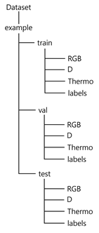
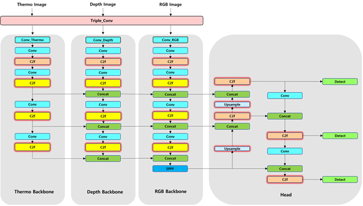

# Triple YOLOv8
- This model uses three types of images as inputs RGB, Depth, and thermal images to perform object detection.
- The model has been modified to accept three inputs. Therefore, to achieve good performance, further modifications to the model are necessary. The current configuration of the model is shown in Figure 1 below.

# Prepare Dataset
- Please organize the dataset folder according to the following image.
- Please put RGB images in the RGB folder, Depth images in the D folder, and thermal images in the Thermo folder.
- In the label folder, include only one bounding box labeling for the RGB images. The images and labels in all folders should have the same names.
- Example: RGB - test.jpg / D - test.jpg / Thermo - test.jpg / labels - test.txt

  

# Model Architecture
- The Architecture of the model is just a basic one copied from the backbone. For better performance, it is recommended to modify the model architecture.
